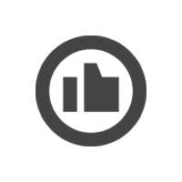

# CSS动画相关知识

>内容参考自[CSS Transform属性及应用](https://github.com/junruchen/junruchen.github.io/wiki/CSS-Transform%E5%B1%9E%E6%80%A7%E5%8F%8A%E5%BA%94%E7%94%A8)
>内容参考自[CSS动画：animation、transition、transform、translate傻傻分不清](https://juejin.im/post/5b137e6e51882513ac201dfb)

## 容易混淆的几个css属性

animation  动画。关键帧，往复性。用于设置动画属性，它是一个简写的属性，包含6个属性

transition  过渡。属性，触发动作，一过性。

transform 变换。复杂的变换参数。用于元素进行旋转、缩放、移动或倾斜。

translate 移动。translate只是transform的一个属性值，即移动。

## transition

什么叫过渡？字面意思上来讲，就是元素从这个属性(color)的某个值(red)过渡到这个属性(color)的另外一个值(green)，这是一个状态的转变，需要一种条件来触发这种转变，比如我们平时用到的:hoever、:focus、:checked、媒体查询或者JavaScript。
transition产生动画的条件是transition设置的property发生变化，这种动画的特点是需要“一个驱动力去触发”有着以下几个不足：

1. 需要事件触发，所以没法在网页加载时自动发生
2. 是一次性的，不能重复发生，除非一再触发
3. 只能定义开始状态和结束状态，不能定义中间状态，也就是说只有两个状态
4. 一条transition规则，只能定义一个属性的变化，不能涉及多个属性。

语法：transition: property duration timing-function delay;

值|描述
-------------------|-------------------------
transition-property|规定设置过渡效果的 CSS 属性的名称
transition-duration|规定完成过渡效果需要多少秒或毫秒
transition-timing-function|规定速度效果的速度曲线
transition-delay|定义过渡效果何时开始

## animation

animation是由多个transition的效果叠加，并且可操作性更强，能够做出复杂酷炫的效果
语法：animation: name duration timing-function delay iteration-count direction play-state fill-mode;

值|描述
-|-
name|用来调用@keyframes定义好的动画，与@keyframes定义的动画名称一致
duration|指定元素播放动画所持续的时间
timing-function|规定速度效果的速度曲线，是针对每一个小动画所在时间范围的变换速率
delay|定义在浏览器开始执行动画之前等待的时间，值整个animation执行之前等待的时间
iteration-count|定义动画的播放次数，可选具体次数或者无限(infinite)
direction|设置动画播放方向：normal(按时间轴顺序),reverse(时间轴反方向运行),alternate(轮流，即来回往复进行),alternate-reverse(动画先反运行再正方向运行，并持续交替运行)
play-state|控制元素动画的播放状态，通过此来控制动画的暂停和继续，两个值：running(继续)，paused(暂停)
fill-mode|控制动画结束后，元素的样式，有四个值：none(回到动画没开始时的状态)，forwards(动画结束后动画停留在结束状态)，backwords(动画回到第一帧的状态)，both(根据animation-direction轮流应用forwards和backwards规则)，注意与iteration-count不要冲突(动画执行无限次)

## transform相关

### transform-origin

设置对象变换的原点，通常和rotate旋转、scale缩放、skew斜切等一起使用，IE9+

2D情况下：默认值 50% 50%，即center center

3D情况下：默认值 50% 50% 0

取值介绍：

1. X轴：left｜center｜right｜length｜%
2. Y轴：top｜center｜bottom｜length｜%
3. Z轴：length

注意：如果只设置一个值，则该值作用于横坐标，纵坐标默认50%，Z轴默认为0，另外百分比是相对于自身进行计算的。

如：

```css
{
  transform: rotate(45deg);
  transform-origin: 0 0;
  -ms-transform: rotate(45deg);     /* IE 9 */
  -ms-transform-origin: 0 0;
  -moz-transform: rotate(45deg);    /* Firefox */
  -moz-transform-origin: 0 0;
  -webkit-transform: rotate(45deg); /* Safari Opera and Chrome */
  -webkit-transform-origin: 0 0;
}
```

### 角度的单位

CSS3新增，角度单位有四种，在所有可使用角度的地方均可使用这四种单位，但是需要注意兼容性，除turn单位外其他单位均可兼容IE9+浏览器版本。

单位说明：
90deg = 100grad = 0.25turn ≈ 1.570796326794897rad

单位|说明
-|-
deg|度数，一个圆共360度，IE9+
grad|梯度，一个圆共400梯度，IE9+
rad|弧度，一个圆共2n弧度，IE9+
turn|转、圈，一个圆共1转，IE＋ FireFox13.0+

### transform

变换，可对元素进行位移、旋转、缩放、倾斜操作，支持2D或者3D转换，IE9+支持。

#### translate 位移

对象进行2D空间或3D空间的位移。 使用规则：

```css
translate(): 第一个参数指定X轴的位移量[必须], 第二个参数指定Y轴的位移量[当不设置时, 默认为0];
translateX(): 指定X轴的位移;
translateY(): 指定Y轴的位移;
translate3D(): 第一个参数指定X轴的位移量, 第二个参数指定Y轴的位移量, 第三个参数指定Z轴的位移量, 3个参数缺一不可;
translateZ(): 指定Z轴的位移;
```

使用translate时需要注意位移量的百分比是相对元素自身宽高来计算的。

translate有一个最常见的应用，即当元素宽度高度不固定时，使用translate可实现水平以及垂直方向的居中。

代码示例：

```html
  dom结构
  <div class="box">
    <div class="item">center</div>
  </div>

  样式设计
  .box{
    position: relative;
    width: 300px;
    height: 300px;
    border: 1px solid;
  }
  .item{
    position: absolute;
    padding: 50px;
    background-color: #fb3;
    top: 50%; /*相对于父级*/
    left: 50%;

    transform: translate(-50%, -50%); /*相对自身*/

    -ms-transform: translate(-50%, -50%);
    -moz-transform: translate(-50%, -50%);
    -webkit-transform: translate(-50%, -50%);
  }
```

效果图：


#### rotate 旋转

对象进行2D空间或3D空间旋转。常与 transform-origin 一起使用。

使用规则：

```css
rotate(): 2D旋转，根据指定的旋转角度进行旋转;
rotate3D(): 3D旋转，必须指定四个参数，前3个参数分别表示旋转的方向x y z, 第4个参数表示旋转的角度;
rotateX(): 指定X轴的旋转角度;
rotateY(): 指定Y轴的旋转角度;
rotateZ(): 指定Z轴的旋转角度;
```

使用rotate时需要注意以下几点：

1. 旋转角度必须有单位，否则将报错。
2. rotate值为正值时，顺时针旋转；否则逆时针旋转。
3. 在2D情况下，rotate()只能指定一个参数；在3D情况下，rotate3D()必须指定四个参数，否则将报错。

旋转45度，代码示例：

```css
 /* X轴旋转45度 */
    .item1{
        transform: rotateX(-45deg);

        -moz-transform: rotateX(-45deg);
        -ms-transform: rotateX(-45deg);
        -webkit-transform: rotateX(-45deg);
    }

    /* Y轴旋转45度 */
    .item2{
        transform: rotateY(-45deg);

        -moz-transform: rotateY(-45deg);
        -ms-transform: rotateY(-45deg);
        -webkit-transform: rotateY(-45deg);
    }

    /* Z轴旋转45度 */
    .item3{
        transform: rotateZ(-45deg);

        -moz-transform: rotateZ(-45deg);
        -ms-transform: rotateZ(-45deg);
        -webkit-transform: rotateZ(-45deg);
    }
```

示例图：


上述例子中的 rotateZ(-45deg);也可以写成 rotate3D(0,0,1,-45deg);，当然相对于X轴、Y轴的也可使用rotate3d的简写形式。

另外，不难看出只指定Z轴的旋转与2D旋转的效果一致。即以下三种写法得到的旋转效果是一样的：

```css
transform: rotate(-45deg);

transform: rotate3D(0,0,1,-45deg);

transform: rotateZ(-45deg);
```

#### scale 缩放

对象进行2D空间或3D空间缩放。常与 transform-origin 一起使用。

使用规则：

```css
scale(): 第一个参数指定X轴的缩放倍数[必须], 第二个参数指定Y轴的缩放倍数[当不设置时, 默认取第一个参数的值];;
scaleX(): 指定X轴的缩放倍数;
scaleY(): 指定Y轴的缩放倍数;
scale3D(): 第一个参数指定X轴的缩放倍数, 第二个参数指定Y轴的缩放倍数, 第三个参数指定Z轴的缩放倍数, 3个参数缺一不可;
scaleZ(): 指定Z轴的缩放倍数;
```

使用scale时需要注意以下几点：

1. 参数值为倍数，如：scale(2); 表示放大2倍。
2. 参数值是分别相对元素的宽和高进行计算的。即便是scale只设置了一个值，那也是分别计算的。
3. 参数值大于1表示放大；0～1之间为缩小；1表示不变；0的时候元素不可见。
4. 参数值为负数时，除了元素的方向发生改变[x轴反转]，其他规律与正值一致。

负值的情况，代码示例：

```css
 dom结构
  <div class="box">
      <div class="item">Item</div>
  </div>

  样式设计
  .box{
    width: 300px;
    height: 300px;
    border: 1px solid;
  }
  .item{
    width: 100px;
    height: 100px;
    line-height: 100px;
    text-align: center;
    background-color: #fb3;

    transform: scale(-1.2);

    -ms-transform: scale(-1.2);
    -moz-transform: scale(-1.2);
    -webkit-transform: scale(-1.2);
  }
```

效果图：


图中可看出，元素相对于x轴发生了反转，但是缩放效果并没有受影响。

#### skew 斜切（倾斜）

对象进行2D空间斜切。常与 transform-origin 一起使用。skew,其实使用的频率不是很高,当然也没有最低，但是往往，一直都不知道他的变化规则。所以使用起来有点摸不着头脑，动画上的使用,也就没那么优先考虑。y轴顺时针转为正，X轴逆时针转为正。

使用规则：

```css
skew(): 第一个参数对应X轴[必须], 第二个参数对应Y轴[当不设置时, 默认为0];;
skewX(): 指定X轴的斜切;
skewY(): 指定Y轴的斜切;
```

需要注意的是：skew(45deg,45deg)时，会使元素不可见，本来xy轴就有90°差距，再分别旋转45°，相当于180°了，而两个轴旋转角度同为正或负且加起来绝对值超过90°时，元素会发生反转。

skewX(30deg) 如下图：


skew(30deg, 10deg) 如下图：


#### 综合应用

+ 平行四边形
+ 梯形
+ 菱形
+ 折角

##### 平行四边形

原理：使用skew斜切来实现。

先看效果图：


看到效果图，最先想到的是对元素使用skew斜切效果。

简单使用斜切代码：

```css
  dom结构：
  <div class="btn">Home</div>

  样式设计：
  .btn{
    width: 150px;
    height: 40px;
    text-align: center;
    line-height: 40px;
    background-color: #fb3;

    transform: skew(-45deg);

    -moz-transform: skew(-45deg);
    -ms-transform: skew(-45deg);
    -webkit-transform: skew(-45deg);
  }
```

确实实现了平行四边形的效果，但是里面的内容也被斜切了，并不完美。


下面介绍两种方向来实现平行四边形，且内容不会受影响。

第一种是比较常见的，嵌套一层结构，父元素进行斜切，子元素抵消掉斜切。

代码：

```css
  dom结构：
  <div class="box">
    <div class="btn">home</div>
  </div>

  样式设计：
  .box{
    width: 150px;
    height: 40px;
    text-align: center;
    line-height: 40px;
    background-color: #fb3;

    transform: skew(-45deg);

    -moz-transform: skew(-45deg);
    -ms-transform: skew(-45deg);
    -webkit-transform: skew(-45deg);
  }
  .btn{
    transform: skew(45deg);

    -moz-transform: skew(45deg);
    -ms-transform: skew(45deg);
    -webkit-transform: skew(45deg); 
  }
```

第二种方法是使用伪元素，将斜切背景应用在伪元素上。

代码：

```css
  dom结构：
  <div class="btn">home</div> 

  样式设计：
  .btn{
    position: relative;
    width: 150px;
    height: 40px;
    text-align: center;
    line-height: 40px;
  }
  .btn:after{
    position:absolute;
    content: '';
    width: 100%;
    height: 100%;
    top: 0;
    left: 0;
    background-color: #fb3;

    z-index: -1; /* 保证背景不会覆盖住文字 */

    transform: skew(-45deg);

    -moz-transform: skew(-45deg);
    -ms-transform: skew(-45deg);
    -webkit-transform: skew(-45deg);
  }
```

##### 梯形

梯形的实现相对平行四边形来说要复杂一些，需要借助perspective()透视来实现。

先看效果图：


代码：

```css
  dom结构：
  <div class="box">home</div>

  基本样式
  .box {
      position: relative;
      width: 200px;
      height: 60px;
      margin: 50px;
      line-height: 60px;
      text-align: center;
  }
```

下面来说明一下如何实现梯形效果：

和平行四边形的原理一样，梯形的背景仍要写在伪元素上，以防止字体变形。

代码如下：

```css
  .box:after {
    position: absolute;
    content: '';
    top: 0;
    left: 0;
    right: 0;
    bottom: 0;
    z-index: -1;
    background-color: #fb3;
    transform: perspective(20px) rotatex(5deg);

    -moz-transform: perspective(20px) rotatex(5deg);
    -ms-transform: perspective(20px) rotatex(5deg);
    -webkit-transform: perspective(20px) rotatex(5deg);
  }
```

为更好的查看效果，可以给box加上半透明的背景，效果图：


旋转是以元素的中心线进行旋转的，所以要修改一下旋转原点，增加以下代码：

```css
    transform-origin: bottom;
    －moz-transform-origin: bottom;
    -ms-transform-origin: bottom;
    -webkit-transform-origin: bottom;
```

在看效果图：


这时可以发现，元素的高度已经严重缩水了，这时候可以使用scale进行y轴的缩放，修改transform代码如下：

```css
    transform: perspective(20px) rotatex(5deg) scaley(1.3);
    －moz-transform-origin: perspective(20px) rotatex(5deg) scaley(1.3);
    -ms-transform-origin: perspective(20px) rotatex(5deg) scaley(1.3);
    -webkit-transform-origin: perspective(20px) rotatex(5deg) scaley(1.3);
```

效果：


当然也可以利用修改transform-origin的值实现不同的梯形。


代码如下[别忘记兼容性，加上浏览器前缀]：

```css
    右侧直角
    transform-origin: right;
    transform: perspective(20px) rotatex(5deg);

    左侧直角
    transform-origin: left;
    transform: perspective(20px) rotatex(5deg);
```

##### 菱形

菱形的实现有两种，第一种是有rotate结合scale实现，第二种是用clip-path实现。

首先对父级进行旋转 代码：

```css
  dom结构
  <div class="box">
    
  </div>

  基本样式设计：
  .box{
    width: 200px;
    height: 200px;
    border: 1px solid;
    overflow: hidden;

    transform: rotate(45deg);
    -mos-transform: rotate(45deg);
    -mz-transform: rotate(45deg);
    -webkit-transform: rotate(45deg);
  }
  .box img{
    width: 100%;
  }
```

效果图：


现在可以加上scale属性了，更改transform属性为：

```css
    transform: rotate(-45deg) scale(1.41);
```


但是这个方法有限制，每次必须要计算scale放大的比例，并且当图片不是正方形时，就没办法实现较好的菱形效果。

第二种方案，使用clip-path实现。不需要嵌套任何元素。

```css
    clip-path: polygon(0 50%, 50% 0, 100% 50%, 50% 100%);
```

效果图：


##### 折角效果

如果是规则的折角图案，如下图所示，可直接用background实现，详情可见文章[背景应用](https://github.com/junruchen/junruchen.github.io/wiki/CSS-Background%E7%A5%9E%E5%A5%87%E7%9A%84%E6%B8%90%E5%8F%98%E8%89%B2)


代码就不过多说明了,代码示例：

```css
    dom结构
    <div class="box"></div>

    基本样式
    .box {
        width: 200px;
        height: 200px;
        background-color: #58a; /*hack 回退*/
        background: linear-gradient(225deg, transparent 20px, rgba(0, 0, 0, .7) 0), linear-gradient(225deg, transparent 20px, yellowgreen 0);
        background-size: 28px, 100%;
        background-repeat: no-repeat;
        background-position: right top, center;
    }
```

不同角度的折角实现：

效果图：


代码：

```css
  .box{
    position: relative;
    background-color: #58a; /*hack 回退*/
    background: linear-gradient(-150deg, transparent 30px, yellowgreen 0);
  }

  .box:before {
    position: absolute;
    content: '';
    width: 62px;
    height: 34px;
    top: 0;
    right: 0;
    background: linear-gradient(-30deg, transparent 30px, rgba(0, 0, 0, .7) 0);
    transform: rotate(-120deg); 
   }
```

仍需要借助渐变色实现背景，然后旋转。

也可以进行更多的优化，如阴影，圆角，效果图如下：

