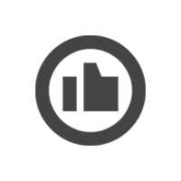

# CSS 动画相关知识

> 内容参考自[CSS Transform 属性及应用](https://github.com/junruchen/junruchen.github.io/wiki/CSS-Transform%E5%B1%9E%E6%80%A7%E5%8F%8A%E5%BA%94%E7%94%A8)
>
> 内容参考自[CSS 动画：animation、transition、transform、translate 傻傻分不清](https://juejin.im/post/5b137e6e51882513ac201dfb)
>
> 内容参考自[CSS3 transform 介绍](https://www.jianshu.com/p/17e289fcf467)
>
> 内容参考自[深入浅出 CSS 动画](https://www.cnblogs.com/coco1s/p/15796478.html)

## 容易混淆的几个 css 属性

animation 动画。关键帧，往复性。用于设置动画属性，它是一个简写的属性，包含 6 个属性

transition 过渡。属性，触发动作，一过性。

transform 变换。复杂的变换参数。用于元素进行旋转、缩放、移动或倾斜。

translate 移动。translate 只是 transform 的一个属性值，即移动。

## transition

什么叫过渡？字面意思上来讲，就是元素从这个属性(color)的某个值(red)过渡到这个属性(color)的另外一个值(green)，这是一个状态的转变，需要一种条件来触发这种转变，比如我们平时用到的:hoever、:focus、:checked、媒体查询或者 JavaScript。
transition 产生动画的条件是 transition 设置的 property 发生变化，这种动画的特点是需要“一个驱动力去触发”有着以下几个不足：

1. 需要事件触发，所以没法在网页加载时自动发生
2. 是一次性的，不能重复发生，除非一再触发
3. 只能定义开始状态和结束状态，不能定义中间状态，也就是说只有两个状态
4. 一条 transition 规则，只能定义一个属性的变化，不能涉及多个属性。

语法：transition: property duration timing-function delay;

| 值                         | 描述                              |
| -------------------------- | --------------------------------- |
| transition-property        | 规定设置过渡效果的 CSS 属性的名称 |
| transition-duration        | 规定完成过渡效果需要多少秒或毫秒  |
| transition-timing-function | 规定速度效果的速度曲线            |
| transition-delay           | 定义过渡效果何时开始              |

## animation

animation 是由多个 transition 的效果叠加，并且可操作性更强，能够做出复杂酷炫的效果
语法：`animation: name duration timing-function delay iteration-count direction fill-mode play-state;`

| 值                 | 描述                                                                        |
| ------------------ | --------------------------------------------------------------------------- |
| animation-name     | 用来调用@keyframes 定义好的动画，与@keyframes 定义的动画名称一致            |
| animation-duration | 设置动画一个周期的时长                                                      |
| timing-function    | 规定速度效果的速度曲线，是针对每一个小动画所在时间范围的变换速率            |
| delay              | 定义在浏览器开始执行动画之前等待的时间，值整个 animation 执行之前等待的时间 |
| iteration-count    | 定义动画的播放次数，可选具体次数或者无限(infinite)                          |
| direction          | 设置动画播放方向                                                            |
| fill-mode          | 控制动画结束后，元素的样式，                                                |
| play-state         | 控制元素动画的播放状态，通过此来控制动画的暂停和继续                        |

### delay

它可以设置动画延时，即从元素加载完成之后到动画序列开始执行的这段时间。

而且它可以设置为**负值**，让动画提前进行。

### timing-function

缓动函数在动画中非常重要，它定义了动画在每一动画周期中执行的节奏。

缓动主要分为两类：

- cubic-bezier-timing-function 三次贝塞尔曲线缓动函数。它支持一些默认的参数：ease，ease-in，ease-in，ease-in-out，linear。还可以使用 cubic-bezier() 方法自定义三次贝塞尔曲线。
- step-timing-function 步骤缓动函数。主要用到的是 steps() 缓动函数。

#### 三次贝塞尔曲线缓动函数

这些函数定义了三次方贝塞尔曲线，由于这些曲线是连续的，因此它们通常用于平滑插值的开始和结束，也称为缓动函数。


三次方贝塞尔曲线由四个点 P0、P1、P2 和 P3 定义。P0 和 P3 是曲线的起点和终点，在 CSS 中，这些点是固定的，因为坐标是比率（横坐标是时间的比率，纵坐标是输出范围的比率）。P0 是并表示初始时间或位置和初始状态，P3 是并表示最终时间或位置和最终状态。`(0, 0)(1, 1)`。P1 和 P2 的横坐标都应该在范围 [0, 1] 内，这样的三次方贝塞尔曲线在 CSS 中才是有效的。

P1 或 P2 纵坐标超出范围的三次方贝塞尔曲线可能会产生弹跳效应。

语法：`cubic-bezier(x1, y1, x2, y2)`

#### 步骤缓动函数

步骤缓动函数，以等距步长划分输出值域，并不是整个动画过程分为设置的 number 帧数，而是每一步都会划分为设置的 number 帧数，比如 keyframes 中只有 from 和 to 两个状态，那么从 from 到 to 就会被分为 number 设置的帧数显示，如果设置了 from 50% to 三个状态，那么从 from 到 50% 会被分为 number 帧，50% 到 to 也会被分为 number 帧。

语法：`steps(number_of_steps, direction)`

- number_of_steps：正整数，表示步骤缓动函数的帧数
- direction：表示函数是左连续还是右连续
  - jump-start：表示左连续函数，第一步或跳转发生在插值开始时，具体效果就是会丢失第一帧。
  - jump-end：表示一个右连续函数，最后一步或跳转发生在插值结束时，具体效果就是会丢失最后一帧。
  - jump-both：表示左右连续函数，包括了在 0% 和 100% 标记处的暂停，在插值迭代期间有效地添加了一帧，具体效果就是丢失第一帧和最后一帧。
  - jump-none：两端都没有跳跃。 相反，在 0% 标记和 100% 标记处都保持 1/n 的持续时间，具体效果就是第一帧和最后一帧都不会丢失。
  - start：相当于 jump-start
  - end：相当于 jump-end

### direction

- normal(按时间轴顺序)
- reverse(时间轴反方向运行)
- alternate(轮流，即来回往复进行)
- alternate-reverse(动画先反运行再正方向运行，并持续交替运行)

### duration

animation-duration 属性指定一个动画周期的时长。默认值为 0s，表示无动画。单位为秒(s)或者毫秒(ms)，无单位值无效。

### iteration-count

animation-iteration-count 控制动画运行的次数，可以是数字或者 infinite（无限循环播放动画）。注意，数字可以用小数定义循环，来播放动画周期的一部分：例如，0.5 将播放到动画周期的一半。不可为负值。

### fill-mode

有四个值：

- none：元素在动画时间之外，样式只受到它的 CSS 规则限制，与 @keyframes 内的关键帧定义无关
- forwards：元素在动画开始之前的样式为 CSS 规则设定的样式，而动画结束后的样式则表现为由执行期间遇到的最后一个关键帧计算值（也就是停在最后一帧）。
- backwords：元素在动画开始之前（包含未触发动画阶段及 animation-delay 期间）的样式为动画运行时的第一帧，而动画结束后的样式则恢复为 CSS 规则设定的样式。
- both：综合了 animation-fill-mode: backwards 和 animation-fill-mode: forwards 的设定。动画开始前的样式为动画运行时的第一帧，动画结束后停在最后一帧。

在 CSS 动画中，由 animation-iteration-count 和 animation-direction 共同决定动画运行时的第一帧和最后一帧的状态。

- 动画运行的第一帧由 animation-direction 决定
- 动画运行的最后一帧由 animation-iteration-count 和 animation-direction 决定

### play-state

它可以控制动画的状态：运行或者暂停。它有两个值：running(继续)，paused(暂停)。可以默认设置暂停，鼠标交互后设置继续来实现很多有趣效果。

### animation 动画的分治与复用

animation 是可以接收多个动画的，这样做的目的不仅仅只是为了复用，同时也是为了分治，对每一个属性层面的动画能够有着更为精确的控制。

```css
div {
  animation: falldown 2s, fadeIn 2s;
}

@keyframes falldown {
  100% {
    transform: translate(0, 150px);
  }
}
@keyframes fadeIn {
  100% {
    opacity: 0;
  }
}
```

## transform 相关

### transform-origin

设置对象变换的原点，通常和 rotate 旋转、scale 缩放、skew 斜切等一起使用，IE9+

2D 情况下：默认值 50% 50%，即 center center

3D 情况下：默认值 50% 50% 0

取值介绍：

1. X 轴：left ｜ center ｜ right ｜ length ｜%
2. Y 轴：top ｜ center ｜ bottom ｜ length ｜%
3. Z 轴：length

注意：如果只设置一个值，则该值作用于横坐标，纵坐标默认 50%，Z 轴默认为 0，另外百分比是相对于自身进行计算的。

如：

```css
 {
  transform: rotate(45deg);
  transform-origin: 0 0;
  -ms-transform: rotate(45deg); /* IE 9 */
  -ms-transform-origin: 0 0;
  -moz-transform: rotate(45deg); /* Firefox */
  -moz-transform-origin: 0 0;
  -webkit-transform: rotate(45deg); /* Safari Opera and Chrome */
  -webkit-transform-origin: 0 0;
}
```

### 角度的单位

CSS3 新增，角度单位有四种，在所有可使用角度的地方均可使用这四种单位，但是需要注意兼容性，除 turn 单位外其他单位均可兼容 IE9+浏览器版本。

单位说明：
90deg = 100grad = 0.25turn ≈ 1.570796326794897rad

| 单位 | 说明                                      |
| ---- | ----------------------------------------- |
| deg  | 度数，一个圆共 360 度，IE9+               |
| grad | 梯度，一个圆共 400 梯度，IE9+             |
| rad  | 弧度，一个圆共 2n 弧度，IE9+              |
| turn | 转、圈，一个圆共 1 转，IE ＋ FireFox13.0+ |

### transform

变换，可对元素进行位移、旋转、缩放、倾斜操作，支持 2D 或者 3D 转换，IE9+支持。

#### translate 位移

对象进行 2D 空间或 3D 空间的位移。 使用规则：

```css
translate(): 第一个参数指定X轴的位移量[必须],
  第二个参数指定Y轴的位移量[当不设置时, 默认为0];
translateX(): 指定X轴的位移;
translateY(): 指定Y轴的位移;
translate3D(): 第一个参数指定X轴的位移量, 第二个参数指定Y轴的位移量,
  第三个参数指定Z轴的位移量, 3个参数缺一不可;
translateZ(): 指定Z轴的位移;
```

使用 translate 时需要注意位移量的百分比是相对元素自身宽高来计算的。

translate 有一个最常见的应用，即当元素宽度高度不固定时，使用 translate 可实现水平以及垂直方向的居中。

代码示例：

```html
<style>
  .box {
    position: relative;
    width: 300px;
    height: 300px;
    border: 1px solid;
  }
  .item {
    position: absolute;
    padding: 50px;
    background-color: #fb3;
    top: 50%; /*相对于父级*/
    left: 50%;

    transform: translate(-50%, -50%); /*相对自身*/

    -ms-transform: translate(-50%, -50%);
    -moz-transform: translate(-50%, -50%);
    -webkit-transform: translate(-50%, -50%);
  }
</style>

<div class="box"><div class="item">center</div></div>
样式设计
```

效果图：


#### rotate 旋转

对象进行 2D 空间或 3D 空间旋转。常与 transform-origin 一起使用。

使用规则：

```css
rotate(): 2d旋转，根据指定的旋转角度进行旋转;
rotate3D(): 3d旋转，必须指定四个参数，前3个参数分别表示旋转的方向x y z, 第4个参数表示旋转的角度;
rotateX(): 指定X轴的旋转角度;
rotateY(): 指定Y轴的旋转角度;
rotateZ(): 指定Z轴的旋转角度;
```

使用 rotate 时需要注意以下几点：

1. 旋转角度必须有单位，否则将报错。
2. rotate 值为正值时，顺时针旋转；否则逆时针旋转。
3. 在 2D 情况下，rotate()只能指定一个参数；在 3D 情况下，rotate3D()必须指定四个参数，否则将报错。

旋转 45 度，代码示例：

```css
/* X轴旋转45度 */
.item1 {
  transform: rotateX(-45deg);

  -moz-transform: rotateX(-45deg);
  -ms-transform: rotateX(-45deg);
  -webkit-transform: rotateX(-45deg);
}

/* Y轴旋转45度 */
.item2 {
  transform: rotateY(-45deg);

  -moz-transform: rotateY(-45deg);
  -ms-transform: rotateY(-45deg);
  -webkit-transform: rotateY(-45deg);
}

/* Z轴旋转45度 */
.item3 {
  transform: rotateZ(-45deg);

  -moz-transform: rotateZ(-45deg);
  -ms-transform: rotateZ(-45deg);
  -webkit-transform: rotateZ(-45deg);
}
```

示例图：


上述例子中的 rotateZ(-45deg);也可以写成 rotate3D(0,0,1,-45deg);，当然相对于 X 轴、Y 轴的也可使用 rotate3d 的简写形式。

另外，不难看出只指定 Z 轴的旋转与 2D 旋转的效果一致。即以下三种写法得到的旋转效果是一样的：

```css
transform: rotate(-45deg);

transform: rotate3D(0, 0, 1, -45deg);

transform: rotateZ(-45deg);
```

#### scale 缩放

对象进行 2D 空间或 3D 空间缩放。常与 transform-origin 一起使用。

使用规则：

```css
scale(): 第一个参数指定X轴的缩放倍数[必须],
  第二个参数指定Y轴的缩放倍数[当不设置时, 默认取第一个参数的值];
scaleX(): 指定X轴的缩放倍数;
scaleY(): 指定Y轴的缩放倍数;
scale3D(): 第一个参数指定X轴的缩放倍数, 第二个参数指定Y轴的缩放倍数,
  第三个参数指定Z轴的缩放倍数, 3个参数缺一不可;
scaleZ(): 指定Z轴的缩放倍数;
```

使用 scale 时需要注意以下几点：

1. 参数值为倍数，如：scale(2); 表示放大 2 倍。
2. 参数值是分别相对元素的宽和高进行计算的。即便是 scale 只设置了一个值，那也是分别计算的。
3. 参数值大于 1 表示放大；0 ～ 1 之间为缩小；1 表示不变；0 的时候元素不可见。
4. 参数值为负数时，除了元素的方向发生改变[x 轴反转]，其他规律与正值一致。

负值的情况，代码示例：

```html
<style>
  /* 样式设计 */
  .box {
    width: 300px;
    height: 300px;
    border: 1px solid;
  }
  .item {
    width: 100px;
    height: 100px;
    line-height: 100px;
    text-align: center;
    background-color: #fb3;

    transform: scale(-1.2);

    -ms-transform: scale(-1.2);
    -moz-transform: scale(-1.2);
    -webkit-transform: scale(-1.2);
  }
</style>
<div class="box"><div class="item">Item</div></div>
```

效果图：


图中可看出，元素相对于 x 轴发生了反转，但是缩放效果并没有受影响。

#### skew 斜切（倾斜）

对象进行 2D 空间斜切。常与 transform-origin 一起使用。skew,其实使用的频率不是很高,当然也没有最低，但是往往，一直都不知道他的变化规则。所以使用起来有点摸不着头脑，动画上的使用,也就没那么优先考虑。y 轴顺时针转为正，X 轴逆时针转为正。

使用规则：

```css
skew(): 第一个参数对应X轴[必须], 第二个参数对应Y轴[当不设置时, 默认为0];
skewX(): 指定X轴的斜切;
skewY(): 指定Y轴的斜切;
```

需要注意的是：skew(45deg,45deg)时，会使元素不可见，本来 xy 轴就有 90° 差距，再分别旋转 45°，相当于 180° 了，而两个轴旋转角度同为正或负且加起来绝对值超过 90° 时，元素会发生反转。

skewX(30deg) 如下图：


skew(30deg, 10deg) 如下图：


#### perspective 透视

指定 3D 的视距。默认值是 none 表示无 3D 效果，即 2D 扁平化。perspective 只能设 px 值(em 也可以)，指定观察者距离 z=0 平面的距离，为元素及其内容应用透视变换。当值为 0 或负值时，无透视变换。不能设%百分比。值越小表示用户眼睛距离屏幕越近，相当于创建一个较大的 3D 舞台。反之，值越大表示用户眼睛距离屏幕越远，相当于创建一个较小的 3D 舞台。

语法：`perspective: none|length|inherit|initial|unset;`

借用 W3C 的图配合 translateZ 来帮助理解视距。


图中 d 就是 perspective 视距，Z 就是 translateZ 轴的位移。Z 轴正向位移时，3D 舞台将放大。反之，Z 轴负向位移时，3D 舞台将缩小。上图 Z 是 d 的一半，因此 3D 舞台上的元素将是原来的 2 倍。下图 Z 同样是 d 的一半，但由于是负值，所以 3D 舞台上的元素将缩小三分之一。

perspective()与 perspective 属性区别

1. 前者 perspective()函数指定只针对当前变形元素，需要和 transform 其他函数一起使用，仅表示当前变形元素的视距。
2. 后者 perspective 属性指定用于 3D 舞台，即 3D 舞台的视距，里面的子元素共享这个视距

##### perspective-origin

设置视距的基点，看 W3C 的图就能明白


基点默认值是 50% 50%即 center，表示视距基点在中心点不进行任何位移。你可以让基点在 XY 轴上进行位移，产生上图那样的效果。注意该属性同样应该定义在父元素上，适用于整个 3D 舞台。它需要和 perspective 属性结合着一起用。效果如下图：


##### backface-visibility

用于是否可以看见 3D 舞台背面，默认值 visible 表示背面可见，可以设成 hidden 让背面不可见。通常当旋转时，如果不希望背面显示出来，该属性就很有用，设成 hidden 即可。


```html
<style>
  .stage{ float: left; margin: 5px; perspective: 200px; }
  .container { transform-style: preserve-3d; }
  .image { backface-visibility: hidden; }
  .front { position: absolute; z-index: 1; }
  .back { transform: rotateY(180deg); }
  .stage:nth-child(1) .container{ transform: rotateY(0deg); }
  .stage:nth-child(2) .container{ transform: rotateY(30deg); }
  .stage:nth-child(3) .container{ transform: rotateY(60deg); }
  .stage:nth-child(4) .container{ transform: rotateY(90deg); }
  .stage:nth-child(5) .container{ transform: rotateY(120deg);
  .stage:nth-child(6) .container{ transform: rotateY(150deg); }
  .stage:nth-child(7) .container{ transform: rotateY(180deg); }
</style>

<div class="stage">
  <!-- 为节约篇幅该DOM请无脑复制7个 -->
  <div class="container">
    
    
  </div>
</div>
```

DOM 结构中就能看出，是两张图片（一正一反）叠在了一起。由于变形元素 img 设了 backface-visibility: hidden;，当 Y 轴旋转超过 90 度时（Y 轴旋转正好 90 度时，正中间图 4 为一片空白），正面的图片将不可见，底下的背面图片显示出来了。如果将 img 的 backface-visibility 属性去掉（默认为 visibility），效果如下图。Y 轴旋转超过 90 度时，将显示正面的图片的背部（所谓背部对屏幕来说其实就是图片矩阵的 X 轴值取反）：


#### 综合应用

- 平行四边形
- 梯形
- 菱形
- 折角

##### 平行四边形

原理：使用 skew 斜切来实现。

先看效果图：


看到效果图，最先想到的是对元素使用 skew 斜切效果。

简单使用斜切代码：

```html
<style>
  .btn {
    width: 150px;
    height: 40px;
    text-align: center;
    line-height: 40px;
    background-color: #fb3;

    transform: skew(-45deg);

    -moz-transform: skew(-45deg);
    -ms-transform: skew(-45deg);
    -webkit-transform: skew(-45deg);
  }
</style>
<div class="btn">Home</div>
```

确实实现了平行四边形的效果，但是里面的内容也被斜切了，并不完美。


下面介绍两种方向来实现平行四边形，且内容不会受影响。

第一种是比较常见的，嵌套一层结构，父元素进行斜切，子元素抵消掉斜切。

代码：

```html
<style>
  .box {
    width: 150px;
    height: 40px;
    text-align: center;
    line-height: 40px;
    background-color: #fb3;

    transform: skew(-45deg);

    -moz-transform: skew(-45deg);
    -ms-transform: skew(-45deg);
    -webkit-transform: skew(-45deg);
  }
  .btn {
    transform: skew(45deg);

    -moz-transform: skew(45deg);
    -ms-transform: skew(45deg);
    -webkit-transform: skew(45deg);
  }
</style>
<div class="box"><div class="btn">home</div></div>
```

第二种方法是使用伪元素，将斜切背景应用在伪元素上。

代码：

```html
<style>
  .btn {
    position: relative;
    width: 150px;
    height: 40px;
    text-align: center;
    line-height: 40px;
  }
  .btn:after {
    position: absolute;
    content: "";
    width: 100%;
    height: 100%;
    top: 0;
    left: 0;
    background-color: #fb3;

    z-index: -1; /* 保证背景不会覆盖住文字 */

    transform: skew(-45deg);

    -moz-transform: skew(-45deg);
    -ms-transform: skew(-45deg);
    -webkit-transform: skew(-45deg);
  }
</style>
<div class="btn">home</div>
```

##### 梯形

梯形的实现相对平行四边形来说要复杂一些，需要借助 perspective()透视来实现。

先看效果图：


代码：

```html
<style>
  .box {
    position: relative;
    width: 200px;
    height: 60px;
    margin: 50px;
    line-height: 60px;
    text-align: center;
  }
</style>
<div class="box">home</div>
```

下面来说明一下如何实现梯形效果：

和平行四边形的原理一样，梯形的背景仍要写在伪元素上，以防止字体变形。

代码如下：

```css
.box:after {
  position: absolute;
  content: "";
  top: 0;
  left: 0;
  right: 0;
  bottom: 0;
  z-index: -1;
  background-color: #fb3;
  transform: perspective(20px) rotatex(5deg);

  -moz-transform: perspective(20px) rotatex(5deg);
  -ms-transform: perspective(20px) rotatex(5deg);
  -webkit-transform: perspective(20px) rotatex(5deg);
}
```

为更好的查看效果，可以给 box 加上半透明的背景，效果图：


旋转是以元素的中心线进行旋转的，所以要修改一下旋转原点，增加以下代码：

```css
transform-origin: bottom;
－moz-transform-origin: bottom;
-ms-transform-origin: bottom;
-webkit-transform-origin: bottom;
```

在看效果图：


这时可以发现，元素的高度已经严重缩水了，这时候可以使用 scale 进行 y 轴的缩放，修改 transform 代码如下：

```css
transform: perspective(20px) rotatex(5deg) scaley(1.3);
－moz-transform-origin: perspective(20px) rotatex(5deg) scaley(1.3);
-ms-transform-origin: perspective(20px) rotatex(5deg) scaley(1.3);
-webkit-transform-origin: perspective(20px) rotatex(5deg) scaley(1.3);
```

效果：


当然也可以利用修改 transform-origin 的值实现不同的梯形。


代码如下[别忘记兼容性，加上浏览器前缀]：

```css
/* 右侧直角 */
transform-origin: right;
transform: perspective(20px) rotatex(5deg);

/* 左侧直角 */
transform-origin: left;
transform: perspective(20px) rotatex(5deg);
```

##### 菱形

菱形的实现有两种，第一种是有 rotate 结合 scale 实现，第二种是用 clip-path 实现。

首先对父级进行旋转 代码：

```html
<style>
  .box {
    width: 200px;
    height: 200px;
    border: 1px solid;
    overflow: hidden;

    transform: rotate(45deg);
    -mos-transform: rotate(45deg);
    -mz-transform: rotate(45deg);
    -webkit-transform: rotate(45deg);
  }
  .box img {
    width: 100%;
  }
</style>

<div class="box"></div>
```

效果图：


现在可以加上 scale 属性了，更改 transform 属性为：

```css
transform: rotate(-45deg) scale(1.41);
```


但是这个方法有限制，每次必须要计算 scale 放大的比例，并且当图片不是正方形时，就没办法实现较好的菱形效果。

第二种方案，使用 clip-path 实现。不需要嵌套任何元素。

```css
clip-path: polygon(0 50%, 50% 0, 100% 50%, 50% 100%);
```

效果图：


##### 补充 clip-path（裁剪）介绍

clip-path 属性可以防止部分元素通过定义的剪切区域来显示，仅通过显示的特殊区域。剪切区域是被 URL 定义的路径代替行内或者外部 svg，或者定义路线的方法。IE 浏览器不支持，且低版本 webkit 内核浏览器需要添加-webkit-前缀。
裁剪就是从某样东西剪切一块。比如说，我们在 img 元素上，根据需要，剪切一部分需要留下的区域。而在整个裁剪中，将会碰到两个相关的概念：裁剪路径(Clipping Path)和裁剪区域(Clipping Region)。

裁剪路径是我们用来裁剪元素的路径，它标记了我们需要裁剪的区域。它可以是个简单的形状（比如 Web 中常见的矩形），也可以是一个复杂的多边形（不规则的多边形）。
裁剪区域是裁剪路径闭合后所包含的全部区域。

浏览器会裁剪掉裁剪区域以外的区域，不仅是背景及其它类似的内容，也包括 border、text-shadow 等。更赞的是，浏览器不会捕获元素裁剪区域以外的 hover、click 等事件。

clip-path 语法：`clip-path: <clip-source> | [ <basic-shape> || <geometry-box> ] | none`

其默认值是 none。另外简单介绍 clip-path 几个属性值：

- clip-source: 可以是内、外部的 SVG 的 clipPath 元素的 URL 引用
- basic-shape: 使用一些基本的形状函数创建的一个形状。主要包括 circle()、ellipse()、inset()和 polygon()。具体的说明可以看 CSS Shapes 中有关于说明。另外在 CSS Shapes 101 一文中也有详细介绍。
- geometry-box: 是可选参数。此参数和 basic-shape 函数一起使用时，可以为 basic-shape 的裁剪工作提供参考盒子。如果 geometry-box 由自身指定，那么它会使用指定盒子形状作为裁剪的路径，包括任何(由 border-radius 提供的)的角的形状。

注意：

1. 使用 clip-path 要从同一个方向绘制，如果顺时针绘制就一律顺时针，逆时针就一律逆时针，因为 polygon 是一个连续线段，若线段彼此有交集，裁剪区域就会有相减的情况发生，当然如果你特意需要这样的效果除外。
2. 如果绘制时采用比例的方式绘制，长宽就必须要先行设定，不然有可能绘制出来的长宽和我们想像的就会有差距，使用像素绘制就不会有这样的现象。

##### 折角效果

如果是规则的折角图案，如下图所示，可直接用 background 实现，详情可见文章[背景应用](https://github.com/junruchen/junruchen.github.io/wiki/CSS-Background%E7%A5%9E%E5%A5%87%E7%9A%84%E6%B8%90%E5%8F%98%E8%89%B2)


代码就不过多说明了,代码示例：

```html
<style>
  .box {
    width: 200px;
    height: 200px;
    background-color: #58a; /*hack 回退*/
    background: linear-gradient(225deg, transparent 20px, rgba(0, 0, 0, 0.7) 0),
      linear-gradient(225deg, transparent 20px, yellowgreen 0);
    background-size: 28px, 100%;
    background-repeat: no-repeat;
    background-position: right top, center;
  }
</style>
<div class="box"></div>
```

不同角度的折角实现：

效果图：


代码：

```css
.box {
  position: relative;
  background-color: #58a; /*hack 回退*/
  background: linear-gradient(-150deg, transparent 30px, yellowgreen 0);
}

.box:before {
  position: absolute;
  content: "";
  width: 62px;
  height: 34px;
  top: 0;
  right: 0;
  background: linear-gradient(-30deg, transparent 30px, rgba(0, 0, 0, 0.7) 0);
  transform: rotate(-120deg);
}
```

仍需要借助渐变色实现背景，然后旋转。

也可以进行更多的优化，如阴影，圆角，效果图如下：


